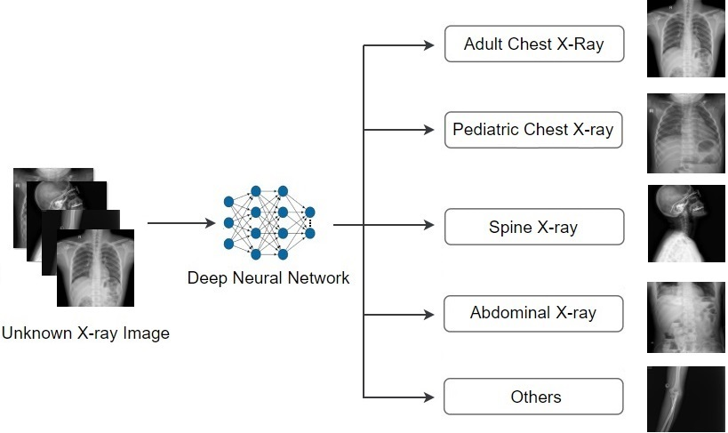

# DICOM Imaging Router: An Open Deep Learning Framework for Classificationof Body Parts from DICOM X-ray Scans


This repository contains the training code for our paper entitled "DICOM Imaging Router: An Open Deep Learning Framework for Classificationof Body Parts from DICOM X-ray Scans", which was accepted by [ICCV Workshop 2021](https://sites.google.com/view/CVAMD2021/).

# Abstract  
X-ray imaging is the most commonly used imaging modality in clinical practice, resultingin vast,  non-normalized databases of X-ray images.  This leads to an obstacle in the de-ployment of artificial intelligence (AI) solutions for analyzing medical images, which oftenrequires identifying the right body part before feeding the image into a specified AI model.This  challenge  raises  the  need  for  an  automated  and  efficient  approach  to  classify  bodyparts from X-ray scans.  To tackle this problem, this paper aims to deploy deep convolu-tional neural networks (CNNs) for categorizing unknown X-ray images into 5 anatomicalgroups:  abdominal, adult chest, pediatric chest, spine, and others.  To this end, a large-scale X-ray dataset consisting of 16,093 images has been collected and manually classified.We then trained a set of state-of-the-art deep CNNs using a training set of 11,263 images.These networks were then evaluated on an independent test set of 2,419 images and showedsuperior performance in classifying the body parts.  Specifically, our best performing model(i.e.  MobileNet-V1) achieved a recall of 0.982 (95% CI, 0.977–0.988), a precision of 0.985(95%  CI,  0.975–0.989)  and  a  F-1  score  of  0.981  (95%  CI,  0.976–0.987),  whilst  requiringless computation for inference (0.0295 second per image).  This remarkable performanceindicates that deep CNNs can accurately and effectively differentiate human body partsfrom X-ray scans, thereby providing potential benefits for a wide range of applications inclinical settings.  To encourage new advances, we will make the dataset, codes and trainedmodels publicly available upon the publication of this paper.  

# Pipeline  
  

# Model training  
## 1. Data Preparation:  
- Image resize (512,512)  
- Split data: training, testing, valid dataset (0.7, 0.15, 0.15)  
- The classes: abdominal, adult chest, pediatric chest, spine, and others.  

## 2. Training Configuration:  
- Configuaration used in the paper are in folder utils. It is recommended that you change training configuaration in constants.py  
```
  step1: 
    pip install -r requirements.txt
  step2:
    python training.py
  step3:
    python test.py
```
# Performance  
#### Table classification performance on the validation set.  
| Model | Recall | Precision | F1-score|
|-------|--------|-----------|---------|
| MobileNet-V1 | 0.982(0.975-0.987) | 0.981(0.975-0.987) | 0.981(0.976-0.987) |  
| MobileNet-V2 | 0.967(0.985-0.976) | 0.979(0.974-0.985) | 0.972(0.965-0.980) |  
| ResNet18     | 0.923(0.909-0.937) | 0.939(0.927–0.951) | 0.930(0.917–0.942) |  
| ResNet34     | 0.923(0.909–0.937) | 0.935(0.923–0.948) | 0.929(0.916–0.941) |  
| EfficientNet-B0 | 0.975(0.968–0.981) | 0.980(0.975–0.986) | 0.977(0.971–0.983) |  
| EfficientNet-B1 | 0.969(0.961–0.977) | 0.977(0.971–0.983) | 0.973(0.966–0.980)|  
| EfficientNet-B2 | 0.973(0.965–0.980) | 0.977(0.972–0.984) | 0.975(0.969–0.982) |  


